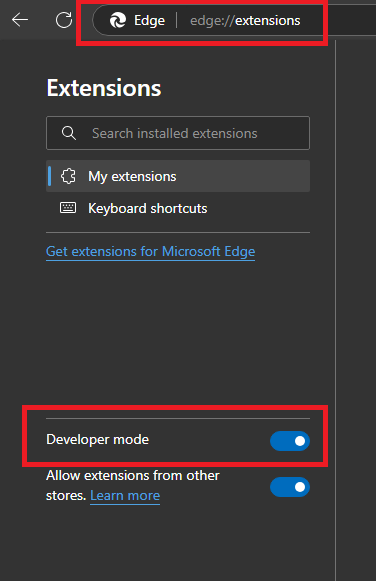
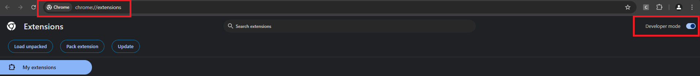
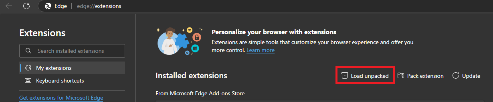
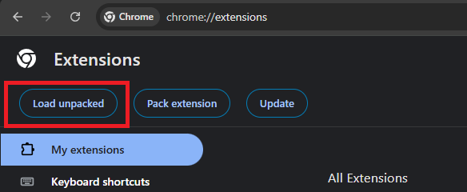

# How to add this extension to browser

- Go to your browsers extensions page and enable developer mode.

### Microsoft Edge 

### Google Chrom

- In the extensions tab, select Load Unpacked option and and select this folder.

### Microsoft Edge 

### Google Chrom

- When you install it for the first time, options menu for the extension will open automatically for api key.
- Login to your account at https://hai.edu.sot.tum.de and create your api key from Profile tab.
- You can change assigned project for any api key whenever you want.